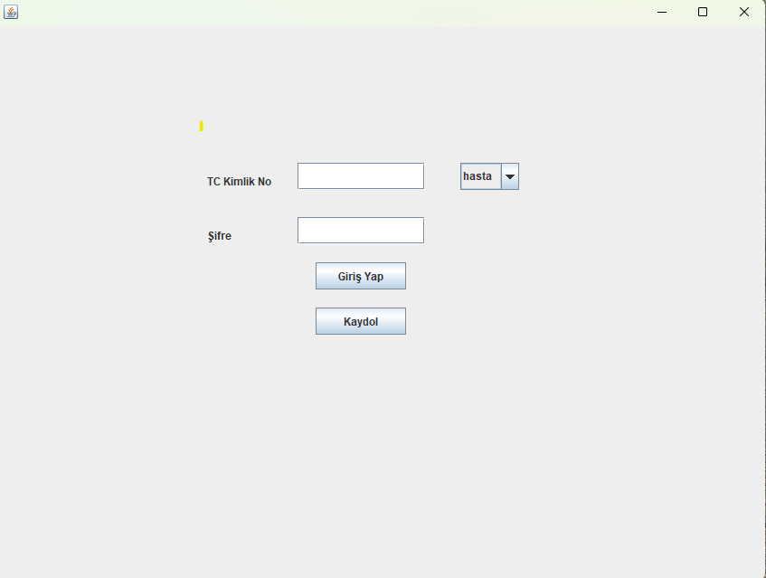
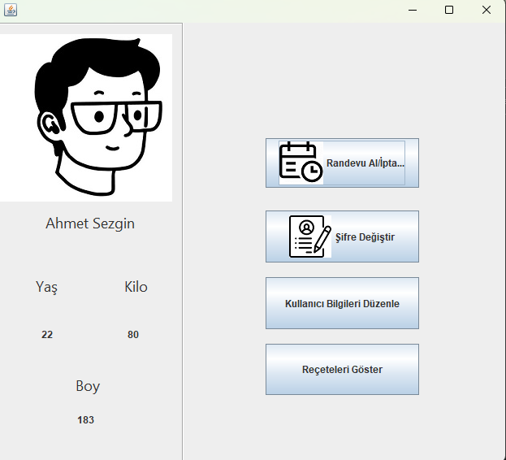
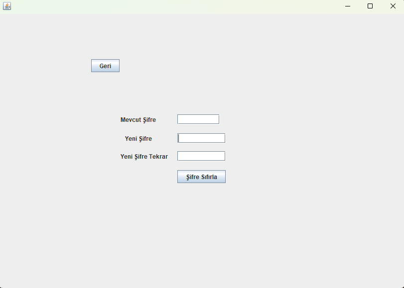
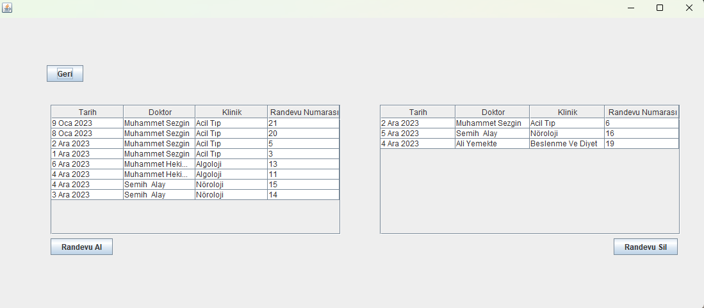
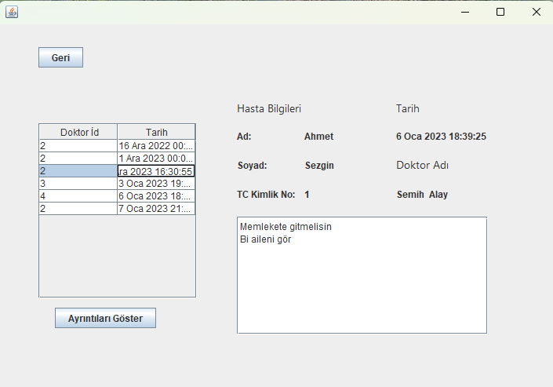
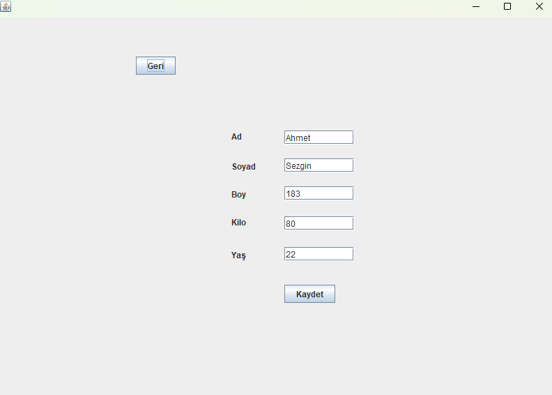
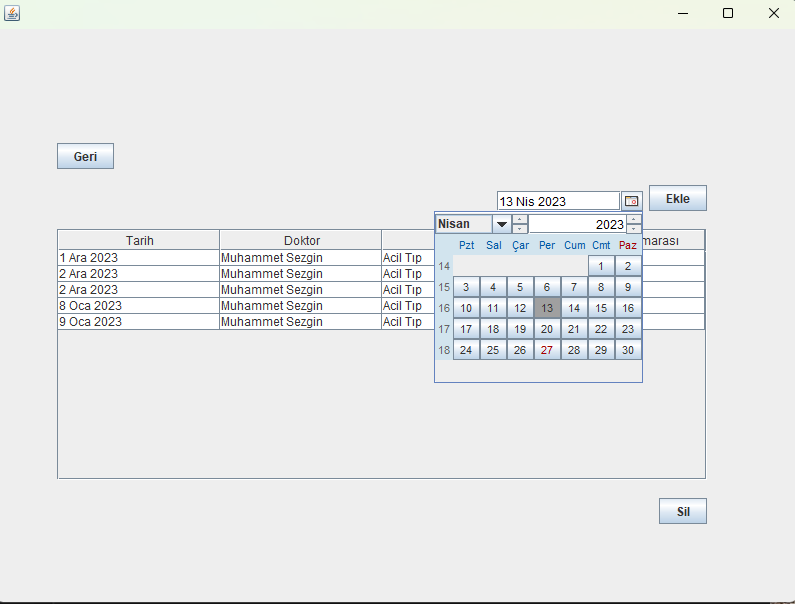
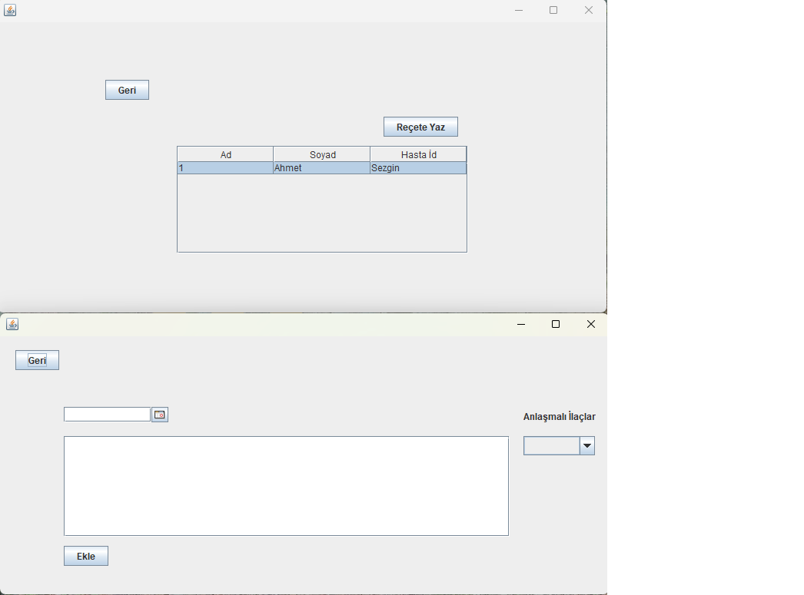

# Hospital Otomation
Object Oriented Project Assignment
A hospital automation system that performs basic operations for hospital staff and patients with a graphical user interface, using Java and MySQL.
 
User information, doctor information, appointment information, prescription information, etc. are stored in a database. New patient registration can be made, and users can edit their personal information. Doctors can set their appointment days, and users who have registered as patients can later make an appointment on those designated days. Along with the appointments, the patient's information is displayed in the doctor's prescription section, where prescriptions can be written. Additionally, in the patient panel, all prescriptions written for the patient can be viewed in the "show your prescription" section.

